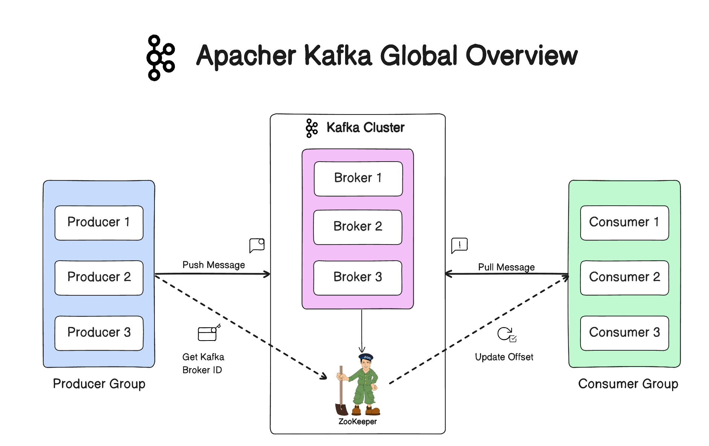
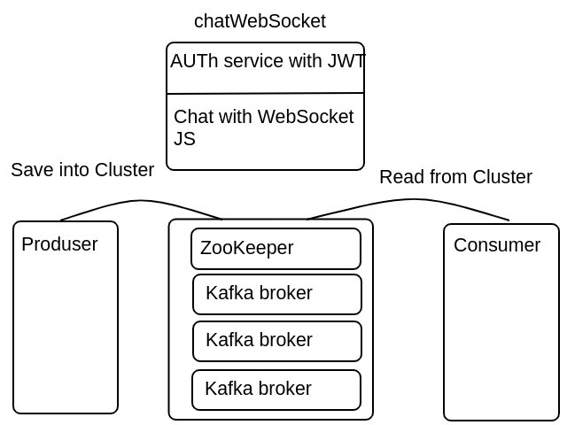

# Kafka Event Streaming System with MySQL Database Integration

This project demonstrates a simple Kafka event streaming system with MySQL database integration. The system includes components for Kafka, Zookeeper, a Kafka producer, a Kafka consumer, and MySQL.

## Prerequisites

- Docker
- Docker Compose
- Spring Boot
- JDK 17

## Setup

1. **Clone the Repository:**

   ```bash   
   https://github.com/manuk2000/Optimizing-Performance-and-Reliability-in-Real-Time-Chat-Systems-with-Kafka-and-Spring.git
   ```

2. **Run Docker Compose:**

   Start Zookeeper, Kafka brokers, and the H2 database by running the following command:

   ```bash
   docker-compose up -d
   ```

   This will start three Kafka brokers (`kafka1`, `kafka2`, `kafka3`), one Zookeeper instance (`zoo1`), the Kafka producer, Kafka consumer, and the H2 database.

3. **Wait for Services to Start:**

   Monitor the logs to ensure that Kafka, Zookeeper, and other services are up and running:

   ```bash
   docker-compose logs -f
   ```

   Wait for the Kafka and Zookeeper services to start. Once ready, proceed to run the Kafka producer and consumer.

4. **Run Kafka Producer:**

   ### Build and run the Kafka producer:


5. **Run Kafka Consumer:**

   ### Build and run the Kafka consumer:

6. **Run Kafka chatWebSocket:**

   ### Build and run the Kafka consumer:

7. **In the browser open :**

   ### http://localhost:8000/:




